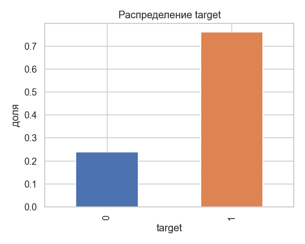
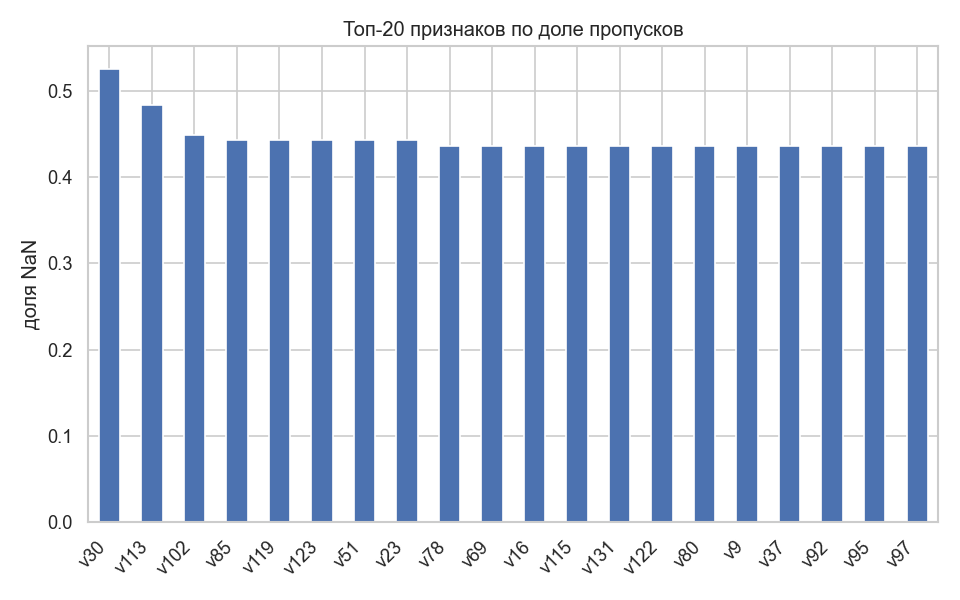
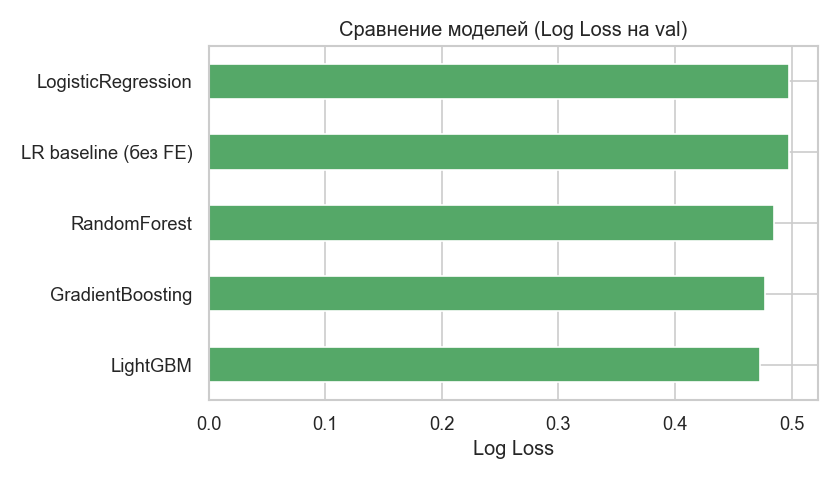
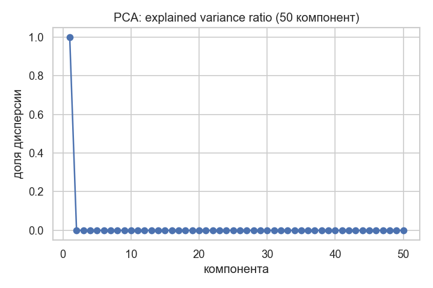
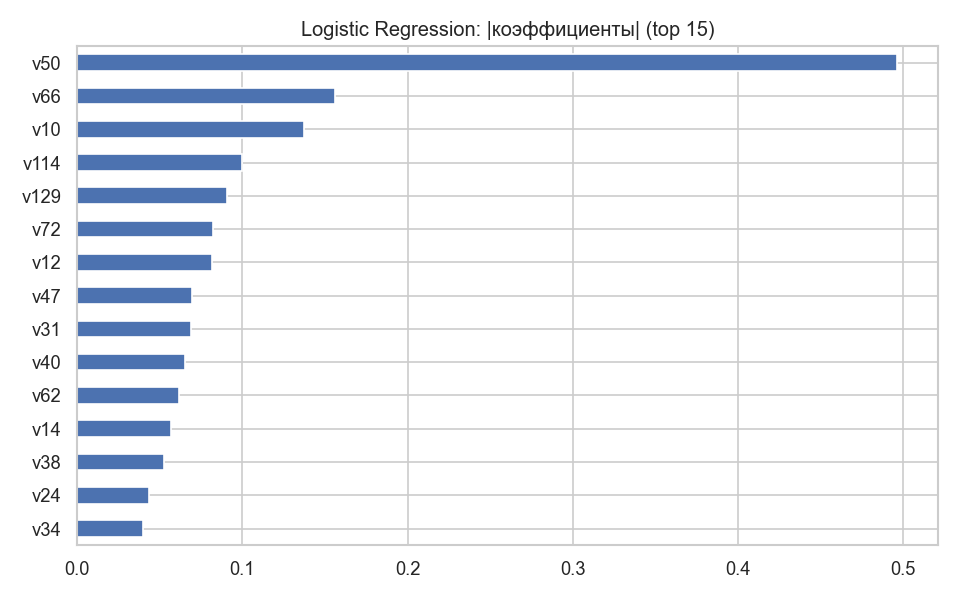
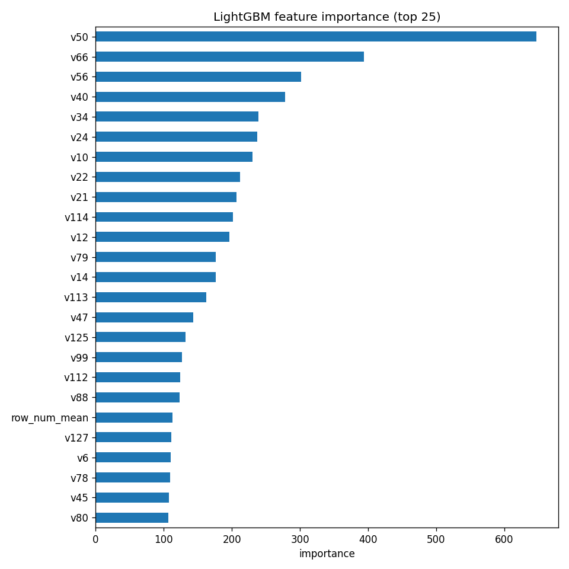
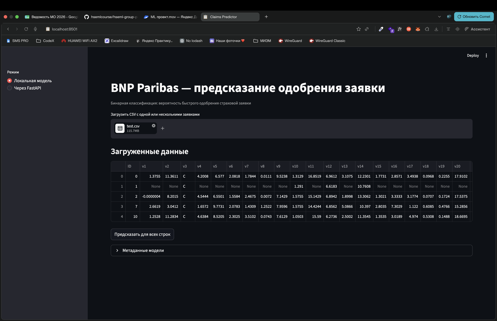
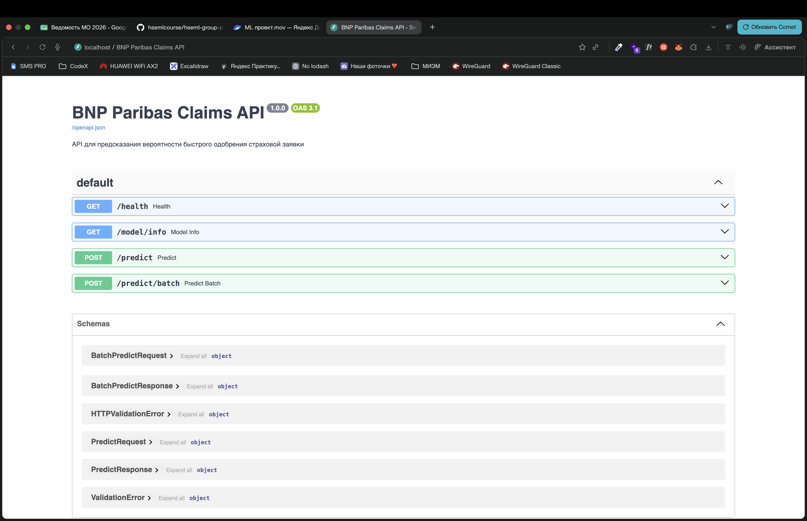

# Отчёт по проекту

**Студент:** Осинцев Кирилл Андреевич  
**Группа:** БИВ235  
**Датасет:** [Kaggle — BNP Paribas Cardif Claims Management](https://www.kaggle.com/c/bnp-paribas-cardif-claims-management)

---

## 1. Введение и постановка задачи

**Цель:** предсказать вероятность того, что страховую заявку можно одобрить сразу (класс 1), без дополнительной ручной проверки (класс 0).

**Задача:** бинарная классификация с выходом — вероятность `P(target=1)`.

**Метрики:**
- **Log Loss** — основная. На Kaggle-соревновании и в бизнесе важна калибровка вероятностей: модель должна не только правильно ранжировать заявки, но и выдавать честные вероятности для принятия решений.
- **ROC-AUC** — дополнительная. Показывает качество ранжирования, но не штрафует за «уверенные ошибки», поэтому используется только для сравнения моделей.

**Приоритет:** минимизируем Log Loss; ROC-AUC смотрим как вспомогательную метрику.

---

## 2. Поиск и описание данных

**Источник:** Kaggle. Датасет выбран, потому что это классическая табличная задача с пропусками, смешанными типами признаков и метрикой Log Loss — близко к реальным задачам скоринга в финтехе/страховании.

**Объём:**
| Файл | Строк | Столбцов |
|------|-------|----------|
| train.csv | 114 321 | 133 (ID + target + 131 признак) |
| test.csv | 114 393 | 132 (ID + 131 признак) |

**Признаки:** 131 анонимизированный признак `v1`…`v131` — числовые и категориальные (буквенные коды). Смысл признаков скрыт организаторами.

**Целевая переменная:** `target` ∈ {0, 1}, доля класса 1 ≈ 76%. Классы несбалансированы, поэтому accuracy не подходит — используем Log Loss и стратифицированный split.



---

## 3. Обработка и подготовка данных

### Очистка
- **Дубликаты:** по `ID` — дублей не найдено (114 321 уникальных строк).
- **Пропуски:** есть у многих признаков (до ~44% у отдельных колонок). Числовые — медиана по train; категориальные — токен `missing`.
- **Выбросы:** явно не удаляли — признаки анонимизированы, деревья устойчивы к выбросам; для LR использовали робастные агрегаты по строке.
- **Типы:** категории приведены к строкам, числовые — к float.



### Feature engineering
Исходно 131 признак → после FE **137**:
- `count_nan_per_row` — сколько пропусков в строке;
- `count_cat_per_row` — сколько заполненных категориальных;
- `row_num_mean/std/min/max` — агрегаты по числовым признакам строки.

**Кодирование категорий:** `LabelEncoder`, обученный на объединении train+test (как на Kaggle — без утечки target).

### Сплит и data leakage
- **Train / Val / Test:** 70% / 15% / 15%, стратификация по `target`, `random_state=42`.
- **Утечки target нет:** все статистики (медианы, энкодеры) считаются только на train-части или без использования target.
- **Kaggle test** используется только для финального сабмита, не для подбора гиперпараметров.

---

## 4. Baseline-модель

**Модель:** Logistic Regression «из коробки» на сырых признаках после простого fillna, **без** feature engineering.

| Метрика | Val |
|---------|-----|
| Log Loss | 0.4976 |
| ROC-AUC | 0.7148 |

Это точка отсчёта: любая более сложная модель должна быть лучше ~0.498 по Log Loss.

---

## 5. Эксперименты

Формат: **Гипотеза → Проверка → Результат**

### Эксп. 1 — Сравнение алгоритмов на подготовленных данных

**Гипотеза:** градиентный бустинг лучше линейной модели на смешанных признаках с пропусками.

**Проверка:** один и т same val-split, дефолтные гиперпараметры sklearn/LightGBM.

**Результат:**

| Модель | Log Loss (val) | ROC-AUC (val) |
|--------|----------------|---------------|
| LightGBM | **0.4726** | **0.7467** |
| GradientBoosting | 0.4772 | 0.7399 |
| RandomForest | 0.4846 | 0.7313 |
| LogisticRegression + FE | 0.4981 | 0.7125 |
| DecisionTree | 11.32 | 0.5867 |



### Эксп. 2 — PCA + Logistic Regression

**Гипотеза:** при 137 признаках PCA уменьшит шум и улучшит LR.

**Проверка:** PCA(50) + LR на том же split.

| Модель | Log Loss | ROC-AUC |
|--------|----------|---------|
| LR baseline | 0.4976 | 0.7148 |
| LR + PCA(50) | 0.4968 | 0.7155 |

**Вывод:** улучшение минимальное; для финальной модели PCA не используем — деревья и так работают с полным набором признаков.



### Эксп. 3 — Подбор гиперпараметров LightGBM

**Гипотеза:** `RandomizedSearchCV` по ключевым параметрам снизит Log Loss.

**Проверка:** 12 итераций, 5-fold CV, scoring = neg_log_loss.

**Лучшие параметры:**
```json
{
  "n_estimators": 400,
  "learning_rate": 0.05,
  "num_leaves": 31,
  "min_child_samples": 100,
  "subsample": 0.7,
  "colsample_bytree": 1.0,
  "reg_lambda": 1.0
}
```

**CV Log Loss (базовый LGBM):** 0.4639 ± 0.0018  
**Hold-out val (после search):** Log Loss 0.4724, ROC-AUC 0.7475

### Эксп. 4 — Feature engineering

**Гипотеза:** агрегаты по строке помогут модели использовать паттерн пропусков.

**Проверка:** сравнение LR с FE и без на val.

**Результат:** FE даёт небольшой, но стабильный выигрыш для линейных моделей; для LightGBM используем тот же пайплайн.

---

## 6. Финальная модель и интерпретируемость

**Выбор:** LightGBM с параметрами из Exp. 3 — лучший Log Loss среди всех протестированных моделей, быстрое обучение (~1.4 с vs ~118 с у sklearn GBC).

**Метрики финальной модели (hold-out 70/15/15):**

| Split | Log Loss | ROC-AUC |
|-------|----------|---------|
| Val | 0.4724 | 0.7475 |
| Test | 0.4682 | 0.7525 |

**Интерпретируемость:** смотрим feature importance LightGBM и |коэффициенты| LR — наибольший вклад у отдельных `v*` признаков и агрегатов `row_num_*`, `count_nan_per_row`. Точный бизнес-смысл скрыт анонимизацией, но видно, что модель опирается и на отдельные поля, и на «профиль пропусков» в заявке.





---

## 7. Деплой

### API (FastAPI)

Сервис: `src/api/main.py`

| Метод | Путь | Описание |
|-------|------|----------|
| GET | `/health` | Проверка живости |
| GET | `/model/info` | Метаданные модели |
| POST | `/predict` | Предсказание по словарю признаков |

**Пример запроса:**
```bash
curl -X POST http://localhost:8000/predict \
  -H "Content-Type: application/json" \
  -d '{"features": {"v1": 0.01, "v2": "A"}}'
```

**Пример ответа:**
```json
{"probability": 0.761234, "prediction": 1, "threshold": 0.5}
```

### Интерфейс (Streamlit)

`src/app/streamlit_app.py` — загрузка CSV или предсказание для примера из test.csv; режим через API или локальную модель.

### Запуск

```bash
python scripts/train_model.py
docker compose up --build
```

- API: http://localhost:8000/docs  
- Streamlit: http://localhost:8501

### Скриншоты





### Видео демонстрации

**Ссылка на видео:** https://disk.yandex.ru/i/k7H0w0NMfco9zg

---

## 8. Заключение и выводы

**Итоги:**
- Baseline LR: Log Loss 0.498 → финальный LightGBM: **0.472** (−5% относительно).
- Основной выигрыш дали нелинейные модели (бустинг) и аккуратная обработка пропусков/категорий.
- Проект воспроизводим: fixed seed, `requirements.txt`, Docker, скрипт обучения.

**Ограничения:**
- Признаки анонимизированы — сложно дать бизнес-интерпретацию отдельным `v*`.
- LabelEncoder на train+test — допустимо для Kaggle, но в проде нужен отдельный fit только на train.

**Улучшения:**
- Target encoding / CatBoost для категорий.
- Stacking LightGBM + RF.
- Калибровка вероятностей (Platt / isotonic) для ещё более низкого Log Loss.
